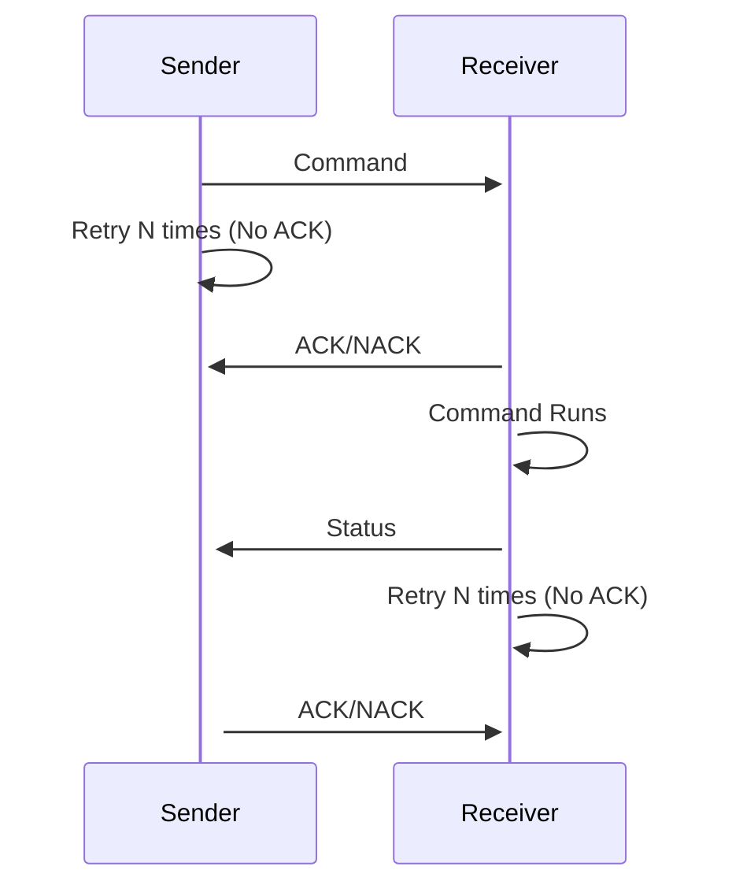

# The Protocol

At a high-level, this library executes an RPC-like set of commands and calls.  The library itself
simply serializes and deserializes to/from string to an agreed upon JSON message format that can be used
to react (receiver side) or metabolize the outcome (sender side).

## Command Message Sequence

The following diagram shows the simple call pattern between a Sender and a Reciever (server).  Note that, given
that this protocol expects commands to take time, we are reliant on an early ACK/NACK signals to ensure
that the command or status itself has been received.



## Command Message Schema

### Commands and Statuses

```typescript
interface CommandMessage {
  for: string // <sender id>
  txn: string // <unique id provided by client>
  command: string // One of a set of command strings
  data: CommandPayload
}

// Status Messages
interface SuccessStatusMessage {
  for: string // <sender id>
  result: 'success'
  txn: string // <matching id from the client>
  data: SuccessResponse
}

interface FailStatusMessage {
  for: string // <sender id>
  result: 'fail'
  txn: string // <matching id from the client>
  error: {
    type: FailureType | | 'unauthorized' | 'unexpected'
    message: string
  }
}
```

#### About

In this paradigm, a command is a string that is agreed upon by the receiver and the sender.  The payload provided gives extra context for these commands to run.

##### Txn (Transaction):

The transaction needs to be a per-client unique string that can be used to verify acknowledgements and statuses against particular commands that were sent back.  It also prevents from running things twice (See Logical Flow below).

__Txn Rule:__

Max 36 characters - enough for uuids, but does not require them

Must be unique across all pending commands for the client

Txn’s can be recycled after a long enough timeout

##### Status Message (Command Returns):
For every command, there should be a status message returned.  The status message should either be a failure or success message with either a data or error field on it for the respective status

__FailStatusMessage:__

The result will always be ‘fail’

The error object should use a predefined set of type strings to indicate known errors

Suggested convention for unexpected failures is ‘unexpected’

The error object message is a free form field that the client can use to log or display

__SuccessStatusMessage:__

The result will always be ‘success’

The data object will always be present

Empty if there is no pertinent info returned

Otherwise, a defined payload for the command return

### ACK/NACK

```typescript
{
  ack: string // <command name> | 'status'
  for: strin // <sender id>
  txn: string // <unique id provided by client>
  timeout?: number // <server dictated timeout>
}

// In the event that there is no command of the name
{
  nack: string // <command name> | 'status'
  for: string // <sender id>
  txn: string // <unique id provided by client>
  reason: 'noSender' | 'noCommand' | 'badMessage'
}
```

#### About:

ack - indicates the command it’s handling

txn - is a transaction that was started by the client - it points to a unique id that the client generated

max characters: 36 - enough for uuids, but not required

timeout - [optional] - used by the server to indicate the full amount of time it believes the command can take

             Note: a client can choose to log if that timeout is larger than its maximum waiting time and even stop listening

 

If a command is unknown or the sender does not exist:

We will send a NACK response.  That essentially means we refuse the command outright.

The reason field can be used to differentiate fast failing responses

## Sender

In the pattern of this protocol, all things are driven by the “Sender”.  The Receiver is the one that is responding to whatever the Sender drives to it.  Both parties can actually be Senders and Receivers but in regards to a single command:

  The one who sends the command is the Sender.  The one who executes and responds is the Receiver.

## One or Multiple Senders

It is up to the Receiver to determine how many senders it allows on a connection.  In this way, if the Receiver expects just 1 sender, it can configure itself to return a ‘tooMany’ failure type.

Work closely with your expected receiver to determine if you need multiple Senders.

One use case for multiple receivers is for having multiple different authorized Senders that are each trying to perform a set of actions against their own authorization set/session.

## Creating a Sender

In order for __any__ sending to occur, a "senderCreate command must be sent on behalf of the perspective client.

### Schemas

```typescript
interface SenderCreateCommand<AuthPayload = Record<string, never>> {
  command: 'senderCreate',
  txn: string // <should be unique for this client>,
  data?: AuthPayload // TODO: this is not fully defined
}

// Success Status
interface SuccessStatusMessage {
  for: string // <sender id> used for the sender
  result: 'success'
  txn: string // <matching id from the client>
  data: {
    inactivity: number
    auth?: auth verification payload
  }
}

interface FailStatusMessage {
  result: 'fail'
  txn: string // <matching id from the client>
  error: {
    type: 'unauthorized' | 'unexpected' | 'tooMany'
    message: string
  }
}
```

#### About

The senderCreate command follows the normal Command Structure for command sending but with a few caveats. 

__Command:__

txn - This is a transaction that should be unique for all commands that are out for this connection (see below for restrictions)

data - depending on the agreed upon message authentication, we will need to decide on an authentication payload

Difference: there is no “from” sender field on this payload due to there being sender yet

__Status:__

On success, the normal success message payload will be returned.  It is expected that the client should store the sender_id for all future requests

The payload’s “inactivity” field should provide the allotted amount of time that the sender can avoid sending a command before the server closes the sender

The auth field returned can be an auth verification object for the sender to use

__Failure:__

The failure may occur due to:

unauthorized - the auth payload was rejected

tooMany - The number of senders for your current connection is at max

unexpected - Another unexpected failure has occured

## Closing a Sender

Since we are establishing a set of senders, anyone adherent with this protocol should be endingSenders in order to save on resources

Note: the Receiver is under no obligation to keep a Sender on.  Senders will process NACKs in the event
that the Receiver drops them.

### Schemas

```typescript
{
  for: string // <sender_id>,
  command: 'senderClose',
  txn: string // <should be unique for this client>,
  data: {
    auth?: AuthPayload // Not fully fleshed out yet
  }
}

// Success Status
interface SuccessStatusMessage {
  for: string // <sender id>
  result: 'success'
  txn: string // <matching id from the client>
  data: {}
}

interface FailStatusMessage {
  for: string // <sender id>
  result: 'fail'
  txn: string // <matching id from the client>
  error: {
    type: 'unauthorized' | 'unexpected'
    message: string
  }
}
```

#### About

The senderClose command should be used to clean up resources for a given sender.  Of course, any receiver should provide a mandated timeout of their own, but in order to be responsible with resources, the sender itself should declare when a sender is closed.

__data:__

for: is the mandatory sender id

auth: This is something to use if we are concerned about multiplexing on a public connection.  It should be some sort of verification token that pairs with the initial authorization to ensure that someone does not close the sender on the connection

__success:__

Upon success, the senderId should no longer be valid for sending

__fail:__

fail has no action to take 